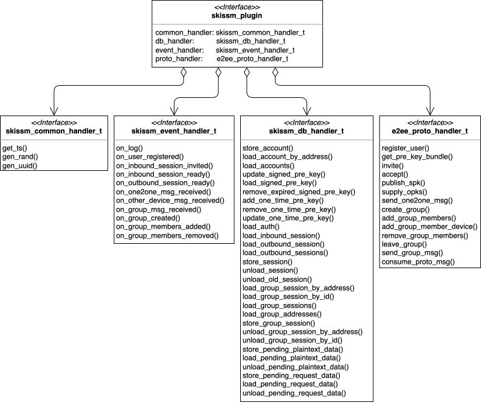
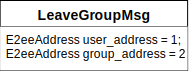
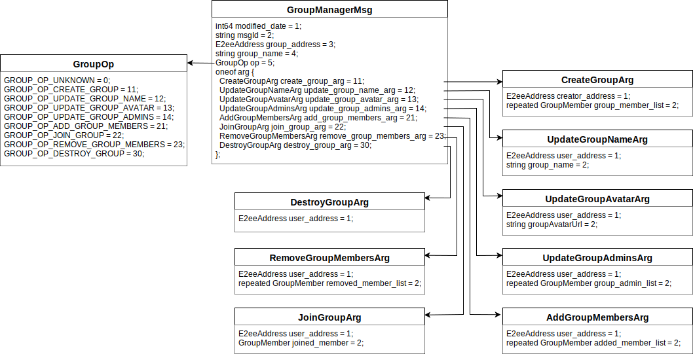

# E2EE Security v1.5.2

End-to-End Encryption Security Whitepaper

Gen-Cher Lee, Hsuan-Hung Kuo

March 22, 2025

  

## Introduction‌

This white paper provides a technical overview on the end-to-end encryption (E2EE) protocols and implemented security aspects.

Fig.1: E2EE Security Architecture

E2EE Security provides an in-depth design of E2EE messaging framework extends the Signal protocol[\[1\]](#ref_1)[\[2\]](#ref_2)[\[3\]](#ref_3)[\[4\]](#ref_4) and supports both pre-quantum and post-quantum cryptographic primitives. E2EE Security supports asynchronous and out-of-order end-to-end message encryption scheme. It also supports one-to-one messaging and group messaging for registered user with multiple devices. The two crucial security properties are provided:
  
* **End-to-end encryption**

    Only sender and recipient (and not even the server) can decrypt the content.

* **Forward secrecy**

    Past sessions are protected against future compromises of keys or passwords.

The extensible software architecture \[Fig.1\] implemented by E2EE Security has been released as open source project [\[19\]](#ref_19).

### Cipher Suites

A cipher suite in E2EE Security is a software interface constructed by the following cryptographic functions. E2EE Security provides an implementation that utilizes the curve25519-donna[\[10\]](#ref_10), mbed TLS [\[11\]](#ref_11) library, and PQClean [\[21\]](#ref_21).

* **get\_param**

    Get the parameters of the cipher suite.

* **asym\_key\_gen**

    Generate a random key pair that will be used to calculate shared secret keys.

* **ds\_key\_gen**

    Generate a random key pair that will be used to generate or verify a signature.

* **encrypt**

    Encrypt a given plaintext.

* **decrypt**

    Decrypt a given ciphertext.

* **sign**

    Sign a message.

* **verify**

    Verify a signature with a given message.

* **hkdf**

    HMAC-based key derivation function.

* **hmac**

    Keyed-Hashing for message authentication.

* **hash**

    Create a hash.

The default cipher suite in the E2EE Security is **E2EE\_CIPHER\_MLDSA87\_MLKEM1024\_AES256\_GCM\_SHA2\_256**, which contains Kyber[\[13\]](#ref_13), Dilithium5[\[18\]](#ref_18), AES256-GCM, SHA2-256.

### Key Size

|  (bytes)  |  public key  |  secret key  |  ciphertext  |
| --------- | --------- | -------- | ------- |
|  mlkem512  |  800  |  1632  |  768  |
|  mlkem768  |  1184  |  2400  |  1088  |
|  mlkem1024  |  1568  |  3168  |  1568  |

|  (bytes)  |  secret key  |  public key  |  signature  |
| --------- | --------- | -------- | ------- |
|  mldsa44  |  2560  |  1312  |  2420  |
|  mldsa65  |  4032  |  1952  |  3309  |
|  mldsa87  |  4896  |  2592  |  4627  |

### Plugins‌

E2EE Security implements a plugin interface to achieve module flexibility for engaging variant application platforms. There are four kinds of plugin handlers \[Fig.2\]:

Fig.2: E2EE Security plugin interface

* **Common handler**

    A common handler provides a set of platform dependent functions for generating time stamp, random number, and universally unique identifier (UUID).

* **Event handler**

    An event handler is used to receive events form E2EE Security while performing E2EE protocol request and processing protocol messages from server. User application can make use of this efficient notification mechanism to catch the changes of states that are maintained by E2EE Security.

* **Database handler**

    A database handler is provided to help E2EE Security keeping data persistency. The state accessibility of user account, one-to-one sessions, and group sessions are finely implemented through a range of database functions.

* **Protocols handler**

    The fourth handler is designated to provide a layer of protocol transportation that helps E2EE Security forwarding the request messages to E2EE Server. The response message of each request is then propagated back to E2EE Security to maintain the states of account and sessions. E2EE Security will use the functional interface of database handler to maintain data persistency of affected sessions and account.

### ‌Addressing‌

To specify an end point address for end-to-end encryption, E2EE Security provides an E2eeAddress struct to represent user address or group address as shown in \[Fig.3\]. An E2eeAddress with PeerUser type is obtained from E2EE server after user registration. The PeerUser data is specified by a user\_id that is created uniquely by the server and a device\_id that is provided by a user. An alternative E2eeAddress with PeerGroup type is obtained from E2EE server after group creation. The PeerGroup data is specified by a uniquely assigned group\_id from server. The uniqueness of user\_id and group\_id is assured in the scope of the same server domain while the uniqueness of device\_id is kept by user application.

Fig.3: E2eeAddress struct

### ‌Account‌

An account keeps user’s address and three types of keys that are used by E2EE schemes. A complete set of keys include a long-term key-pair (IdentityKey), a mid-term key-pair (SignedPreKey), and a bunch (100 as default) of one-time used key-pairs (OneTimePreKey) \[Fig.4\]. On the stage of user registration, the public part of this set of key-pairs will be uploaded to E2EE server to help together with other peers establish sessions for messaging.

Moreover, the SignedPreKey has a special time-to-live (ttl) attribute that helps remember the the next renew time. E2EE Security implements 7 days as the default renewal time interval. On each begin time of E2EE Security activation, the module will check this “ttl”. If it is reached then the “publish signed pre-key” protocol will be requested to submit the public part of newly generated signed pre-key. E2EE server will update the key and use it subsequently to provide clients with PreKeyBundle for creating a new outbound session.

Fig.4: Account struct

### ‌Pre-Key Bundle‌

Before a user application can build an outbound session, the “get pre-key bundle” protocol will be used to download the data set that encloses pre-key bundles \[Fig.5\]. To get the pre-key bundles of a peer user with given user\_id, E2EE server will gather a list of pre-key bundles with which is related to each device\_id of the same user\_id. A PreKeyBundle just collects the public part of an identity key, a signed pre-key and an one-time pre-key. The E2EE server will remove the used one-time pre-keys after sending the collected pre-key bundles as a response.

Fig.5: PreKeyBundle struct

### ‌Session‌

A Session struct \[Fig.6\] is used to encapsulate the states of one-to-one messaging that will be changed on each encryption or decryption. A session can be used for handling inbound messages or outbound messages alternatively by setting-up the “from” and “to” address attribute. An outbound session is used to send one-to-one encryption message to remote peer, while an inbound session is used to decrypt the incoming one-to-one message received from remote peer. Specially, An outbound session uses the attribute “responded” as a lock that will be enabled if AcceptMsg is received and complete the shared key calculation.

Each session has a “ratchet” attribute with Ratchet struct that maintains the ratchet states [\[3\]](#ref_3) for either inbound or outbound usage. If a ratchet is used for managing outbound session, then it will be operated with a sender chain that has ratchet\_key to assign that an outbound message belongs to this chain, and a “ratchet” attribute to generate message key for encrypting outbound message. On the other hand, if a ratchet is used for managing inbound session, it will be operated with a receiver chain that has a “ratchet\_key\_public” attribute to identify the inbound message belongs to this chain, and a “chain\_key” attribute to generate message key to decrypt inbound message. The skipped messages chain helps maintain the message key that is skipped while an inbound session is performing decryption task over receiver chain. Moreover, each chain has a max chan index 512 as default by E2EE Security. If an outbound session with ratchet of sender chain reaches the limit, a new outbound session will be built as a replacement by using a new PreKeyBundle provided by server.

Fig.6: Session Struct

### ‌Group Session‌

A GroupSession struct \[Fig.7\] is used to encapsulate the states of group messaging that will be changed on each encryption or decryption. A group session can be used for handling inbound group messages or outbound group messages. In the case of outbound group session, the “signature\_private\_key” attribute will be created while an inbound group session only make use of “signature\_public\_key”.

An outbound group session is created after a success request of “create group” protocol and returning a unique group address. Then a GroupPreKeyBundle message will be packed as the payload of a Plaintext type message and delivered to each group member through one-to-one session introduced previously. E2EE server then help forwarding the one-to-one message to recipient. Each group member can build inbound group session after processing the decrypted plaintext with “group\_pre\_key” payload. If some one-to-one outbound is not ready for sending message, E2EE Security will keep the data in database, and the saved “group\_pre\_key\_plaintext” will be resent automatically after a respective AcceptMsg has been received and successfully create the outbound session.

The group members can be altered by requesting “add group members” and “remove group member” protocol. E2EE Security will automatically rebuild the outbound group session if the group members were changed. The inbound group session of each group member will also be rebuilt as a result.
  

Fig.7: GroupSession struct

## ‌Cryptographic Algorithms‌

### ‌Abbreviations‌

* **$bk$**: base key

* **$ck$**: chain key

* **$C$**: ciphertext

* **$Dec(x, y)$**: decrypt message x with key y using AES256 with GCM mode

* **$Decaps(sk, C){\longrightarrow}K$**: Takes as input a ciphertext C and secret key $sk$ and outputs K

* **$Enc(x, y)$**: encrypt message x with key y using AES256 with GCM mode

* **$Encaps(pk)\stackrel{﹩}{\longrightarrow}(C, K)$**: Takes as input a public key pk and outputs a ciphertext C and the encapsulated key K

* **$HKDF(IKM, salt, info)$**: HKDF with SHA-256 with input key material IKM, salt, and info

* **$HMAC(key, input)$**: HMAC with SHA-256 with the key and the input

* **$ik, ik^{-1}$**: identity key pair

* **$mk$**: message key

* **$opk, opk^{-1}$**: one-time pre-key pair

* **$P$**: plaintext

* **$rk, rk^{-1}$**: ratchet key pair

* **$RK$**: root key

* **$Sign(x, y)$**: sign message x with private key y and output the signature sig

* **$spk, spk^{-1}$**: signed pre-key pair

* **$sk$**: shared secret key

* **$sk\_priv$**: signature private key

* **$sk\_pub$**: signature public key

* **$Verify(sig, k)$**: verify the signature sig with the public key k

### ‌‌Algorithms‌

#### PQKA

The key agreement process cannot complete at Alice’s side alone in the case of applying post quantum cryptographic (PQC) primitives [\[12\]](#ref_12)[\[13\]](#ref_13)[\[14\]](#ref_14)[\[15\]](#ref_15) that mainly work with key encapsulation mechanisms (KEM) [\[16\]](#ref_16)[\[17\]](#ref_17)[\[18\]](#ref_18). The flow for calculating the shared key for both Alice and Bob is altered by E2EE Security \[Fig.8\]. An invite message is sent on creating a new outbound session. The outbound session is not able to send encrypted messages before receiving an accept message and completing the calculation of shared key. E2EE Security implements “invite” and “accept” protocols as a compromise to enable PQKA to work in a uniform data flow for post quantum cryptographic primitives.

Fig.8: Invite and accept protocol

To build a new outbound session, Alice first acquires Bob's pre-key bundle from the server, then performs the following steps:

* Verify(Sig, $ik_B$)

* Generate the base key $bk_A$.

* Start calculating the shared secrets.

    Calculate (c2, k2) $\stackrel{﹩}{\longleftarrow}Encaps(ik_B)$.

    Calculate (c3, k3) $\stackrel{﹩}{\longleftarrow}Encaps(spk_B)$.

    Calculate (c4, k4) $\stackrel{﹩}{\longleftarrow}Encaps(opk_B)$.

* Send [InviteMsg](#ref_‌InviteMsg) to Bob with pre\_shared\_input_list: c2, c3, c4.

When Bob receives the [InviteMsg](#ref_‌InviteMsg) from Alice, perform the following steps:

* Calculate the shared secrets

    Calculate (c1, k1) $\stackrel{﹩}{\longleftarrow}Encaps(ik_A)$.

    Calculate k2 ← Decaps($ik_B^{-1}$, c2).

    Calculate k3 ← Decaps($spk_B^{-1}$, c3).

    Calculate k4 ← Decaps($opk_B^{-1}$, c4).

    secret(128 bytes) = k1 || k2 || k3 || k4

    sk(64 bytes) = HKDF(secret, salt\[32\]={0}, info=“ROOT”)

* Send [AcceptMsg](#ref_‌AcceptMsg) with encaps\_ciphertext, which is c1.

After Alice receives the [AcceptMsg](#ref_‌AcceptMsg) from Bob, she will complete her outbound session by:

* Calculate Decaps($ik_A^{-1}$, c1) where c1 is obtained from the encaps\_ciphertext of received AcceptMsg.

* secret(128 bytes) = k1 || k2 || k3 || k4

* sk(64 bytes) = HKDF(secret, salt\[32\]={0}, info=“ROOT”).

#### One2one message

The double ratchet algorithm[\[3\]](#ref_3), comprising the asymmetric ratchet and the symmetric ratchet, is employed for sending One2one messages. After the session is created or receiving the other's message, we use the asymmetric ratchet to send a message. On the other hand, we use the symmetric ratchet to send a message after sending some messages to the other.

##### Asymmetric Ratchet

To encrypt a message, we do the following steps:

* RK(32 bytes) = prefix 32 bytes of sk

* Calculate ($rk_A$, secret\_input) $\stackrel{﹩}{\longleftarrow}Encaps(spk_B)$ on Alice's side or ($rk_B$, secret\_input) $\stackrel{﹩}{\longleftarrow}Encaps(bk_A)$ on Bob's side.

* Next sk(64 bytes)

    \= HKDF(secret\_input, salt=RK, info="RATCHET")

    \= next RK(32 bytes) || sender\_chain\_key(32 bytes)

* mk(48 bytes)

    \= HKDF(sender\_chain\_key, salt\[32\]={0}, info="MessageKeys")

* C = Enc(P, mk)

* Send C and $rk_A$ to Bob or send C and $rk_B$ to Alice.

To decrypt a message, we do the following steps:

* RK(32 bytes) = prefix 32 bytes of sk

* secret\_input = Decaps($bk_A^{-1}$, $rk_B$) on Alice's side or Decaps($spk_B^{-1}$, $rk_A$) on Bob's side.

* Next sk(64 bytes)

    \= HKDF(secret\_input, salt=RK, info="RATCHET")

    \= next RK(32 bytes) || receiver\_chain\_key(32 bytes)

* mk(48 bytes)

    \= HKDF(receiver\_chain\_key, salt\[32\]={0}, info="MessageKeys")
    
* P = Dec(C, mk)

##### Symmetric Ratchet

To perform symmetric ratchet, we generate a new chain key by using the current chain key: $ck_2 = HMAC(ck_1)$. Next, generate the message key by $mk_2 = HKDF(ck_2)$. We then encrypt the message with $mk_2$.

#### Group message

Secure group messaging protocols have been the focus of much recent cryptographic work. We referred to the design of DCGKA[\[20\]](#ref_20) to ensure the following properties:

* Decentralization: Servers may still optionally be used, but they are trusted less.

* Efficiency: The group creation and group membership synchronization have linear complexity.

* Authentication: Only members can send messages to the group, and the sender of a message cannot be forged.

* Confidentiality: The message sent by a group member can only be decrypted by users who are members of the group at the time the message is sent.

* Integrity: Messages cannot be undetectably modified by anyone other than the sender.

* Forward Secrecy: After decrypting a group message, an adversary who compromises the private state of the member can't decrypt it.

* Post-Compromise Security (PCS): If a group member is compromised by an adversary but still can send messages, the adversary can't decrypt messages from any group member who has completed the PCS update.

##### Create group

Each group member creates an outbound group session for encrypting and sending group message. On the other hand, the other group members create inbound group session with respect to the outbound group session for decrypting received group message \[Fig.9\].

* The group creator creates an outbound group session by generating a random seed secret(ss). The creator then combines the seed secret with his or her own identity public key to generate a chain key with HKDF.

* The group creator then send the seed secret to each group member by using one-to-one session. Each group member can build their own outbound group session by using the seed secret.

Fig.9: Group session creation

Also, the server needs to send the group members’ identity public key to all the other group members so that every group member can generate the corresponding inbound group sessions \[Fig.10\].

Fig.10: Chain key generation

To encrypt and send outbound group message, Alice uses the established outbound group session and performs the following steps \[Fig.11\]:

* mk = HKDF(ck)

* C = Enc(P, mk)

* Sig = Sign(C, ik\_priv)

* Send (C, Sig) to each group member

Alice uses the outbound group session to ratchet ck for the next encryption.

Fig.11: Group message delivery

To decrypt a received inbound group message, Bob and other group members use the established inbound group session and perform the following steps:

* Verify(Sig, ik\_pub)

* mk = HKDF(ck)

* P = Dec(C, mk)

Each group member uses their own inbound group session to ratchet ck for the next decryption.

##### ‌Add members

When a new group member is added to the group, the other old group members need to send their current chain key to the new group member via one-to-one session so that this new group member can create corresponding inbound group sessions. On the other hand, the new group member creates his or her outbound group session with the inviter’s(the one who invites the new group member to join the group) chain key. Since all of the old group members have the inviter’s chain key, they can create the inbound group session that can be used to decrypt the new group member’s group message \[Fig.12\].

Fig.12: Add a group member

##### ‌Remove members

When some group members are removed, the group member who makes the changed event will generate a new seed secret and send to other remained group members via one-to-one session, so that all of the remained group members will rebuild group sessions, including outbound and inbound. As a result, all outbound and inbound group sessions will be renewed, and the removed group members has no information about the updated group sessions.

## E2EE Protocols‌

E2EE Security offers offers various request-response protocols and aids in managing server-sent messages \[Fig.13\]. The request-response protocols provide a direct control and message exchange mechanism for interacting with the E2EE server, enabling better integration with user applications. On the other hand, the server-sent events protocol efficiently notifies E2EE Security and keeps the states of accounts and sessions updated with the E2EE messaging schemes.

  

Fig.13: E2EE protocols

### ‌Request-response protocols‌
  
#### Response code

A response code indicates the response state from server for requesting a resource from client \[Fig.14\].

* RESPONSE\_CODE\_UNSPECIFIED

    The client get a requested response with unknown state.

* RESPONSE\_CODE\_OK

    The request succeeded, and some resources were read or updated.

* RESPONSE\_CODE\_CREATED

    The request succeeded, and some new resources were created as a result.

* RESPONSE\_CODE\_ACCEPTED

    The request has been received but not yet acted upon.

* RESPONSE\_CODE\_NO\_CONTENT

    There is no content to send for this request, and some resources were deleted.

* RESPONSE\_CODE\_BAD\_REQUEST

    The server cannot or will not process the request due to something that is perceived to be a client error.

* RESPONSE\_CODE\_UNAUTHORIZED

    The client is not authenticated to get the requested response.

* RESPONSE\_CODE\_FORBIDDEN

    The client is authenticated but does not have access rights to the content.

* RESPONSE\_CODE\_NOT\_FOUND

    The server can not find the requested resource.

* RESPONSE\_CODE\_REQUEST\_TIMEOUT

    The server timed out waiting for the request, or the client timed out waiting for the response.

* RESPONSE\_CODE\_REQUEST\_CONFLICIT

    Indicates that the request could not be processed because of conflict in the current state of the resource.

* RESPONSE_CODE_EXPECTATION_FAILED

    The server cannot meet the requirements of the expected request data.

* RESPONSE\_CODE\_INTERNAL\_SERVER\_ERROR

    The server has encountered a situation it does not know how to handle.

* RESPONSE\_CODE\_SERVICE\_UNAVAILABLE

    The server is down for maintenance or overloaded.

  
Fig.14: Response code

  
#### Register User

The register user protocol \[Fig.15\] helps create a new account in E2EE Security by sending RegisterUserRequest data. A unique user address will be returned in a successful response from E2EE server.

Fig.15: Register user protocol

#### ‌Publish signed pre-key

The publish signed pre-key protocol \[Fig.16\] helps submit a new signed pre-key to server when the 7 days renew time is exceed that is managed by Account in E2EE Security. E2EE server will keep and replace the old signed pre-key and use the new key to serve the request of “get pre-key bundle” protocol.

Fig.16: Publish signed pre-key protocol

#### ‌Supply one-time pre-key

The supply one-time pre-key protocol \[Fig.17\] helps submit a set of one-time pre-key public parts to E2EE server. This is normally triggered by receiving a SupplyOpkMsg and notifying that server is running out of one-time pre-keys. E2EE Security will create 100 new one-time pre- keys and apply “supply one-time pre-key” protocol to complete the job.

Fig.17: Supply one-time pre-key protocol

#### ‌Get pre-key bundle

The get pre-key bundle protocol \[Fig.18\] helps download PreKeyBundle for creating a new outbound session. By sending a GetPreKeyBundleRequest data with “user\_adress”, E2EE server will return “pre\_key\_bundles” as an array of PreKeyBundle data. E2EE Security will process them and create respective outbound session fro each PreKeyBundle data.

Fig.18: Get pre-key bundle protocol

#### ‌Update User

The update user protocol \[Fig19\] helps user update user’s information by sending UpdateUserRequest data. E2EE server authenticate the user\_id and publish a ProtoMsg to the server-sent messaging channel by packing the UpdateUserMsg data. The peer users who have applied “invite” protocol to this user\_id will receive this message if this channel is subscribed.

  
Fig.19: Update user protocol

#### ‌Invite

The invite protocol \[Fig.20\] helps send InviteMsg to a peer user while build a new outbound session. E2EE server will publish a ProtoMsg to the server-sent messaging channel by packing the InviteMsg data. The peer user will receive this message if this channel is subscribed.

  

Fig.20: Invite protocol

#### ‌Accept

The accept protocol \[Fig.21\] helps send AcceptMsg to a peer user after successfully builds a new inbound session. E2EE server will publish a ProtoMsg to the server-sent messaging channel by packing the AcceptMsg data. The peer user will receive this message if this channel is subscribed.

Fig.21: Accept protocol

#### ‌Send one-to-one message

The send one-to-one message protocol \[Fig.24\] helps send an E2eeMsg data that has “one2one\_msg” as its payload to a remote peer user. E2EE server will publish a ProtoMsg to the server-sent messaging channel by packing the E2eeMsg data. The peer user will receive this message if this channel is subscribed.

Fig.24: Send one-to-one message protocol

#### ‌Create group

The create group protocol \[Fig.25\] helps send the CreateGroupMsg data while E2EE Security is creating a new outbound group session. E2EE server will publish a ProtoMsg to the server- sent messaging channel by packing the CreateGroupMsg data. The peer user will receive this message if this channel is subscribed. E2EE Security will send GroupPreKeyBundle data through one-to-one session to other group members after receiving a successful response. On the other hand, E2EE Security will help each group member who receives CreateGroupMsg data by creating new outbound group session automatically.
  

Fig.25: Create group protocol

#### ‌Add group members

The add group members protocol \[Fig.26\] helps send the AddGroupMembersMsg data to other group members. If E2EE server verifies the user sending this request is a group member with manager role, a ProtoMsg will be published to the server-sent messaging channel by packing the AddGroupMembersMsg data. The peer user will receive this message if this channel is subscribed. The old outbound group session will be renewed after a successful response received. On the other hand, all other group members will also renew their old outbound group sessions on receiving the AddGroupMembersMsg data.

Fig.26: Add group members protocol

#### ‌Remove group members

The remove group members protocol \[Fig.27\] helps send the RemoveGroupMembersMsg data to other group members. If E2EE server verifies the user sending this request is a group member with manager role, a ProtoMsg will be published to the server-sent messaging channel by packing the RemoveGroupMembersMsg data. The peer user will receive this message if this channel is subscribed. A new outbound group session will be rebuilt after a successful response received. On the other hand, all other group members will also rebuild a new outbound group session on receiving the RemoveGroupMembersMsg data.

Fig.27: Remove group members protocol

#### ‌Add group member device

The add group member device protocol \[Fig.28\] helps send the AddGroupMemberDeviceMsg data to other group members. If E2EE server verifies the user sending this request is a group member, a ProtoMsg will be published to the server-sent messaging channel by packing the AddGroupMemberDeviceMsg data. The peer user will receive this message if this channel is subscribed. The old outbound group session will be renewed after a successful response received. On the other hand, all other group members will also renew their old outbound group sessions on receiving the AddGroupMemberDeviceMsg data.

Fig.28: Add group member device protocol

#### ‌Leave group

The leave group protocol \[Fig.29\] helps send the LeaveGroupMsg data to the group manager. If E2EE server verifies the user sending this request is a group member, a ProtoMsg will be published to the server-sent messaging channel by packing the LeaveGroupMsg data. The peer user will receive this message if this channel is subscribed. The original outbound and inbound group sessions will be released after a successful response received. On the other hand, the group manager will activate the remove group members protocol on receiving the LeaveGroupMsg data.
  

Fig.29: Leave group protocol

#### ‌Send group message

The send group message protocol \[Fig.30\] helps send an E2eeMsg data that has “group\_msg” as its payload to a remote peer user. E2EE server will create a ProtoMsg by packing the E2eeMsg data and replicate it for each address of all other members. Then publish each E2eeMsg to the server-sent messaging channel. The peer user will receive this message if this channel is subscribed.

Fig.30: Send group message protocol

#### ‌Consume ProtoMsg

The consume ProtoMsg protocol \[Fig.31\] helps notify E2EE server that a ProtoMsg with pro\_msg\_id has been successfully processed by E2EE Security. E2EE server will remove the ProtoMsg that is stored in server database and return a successful response.

Fig.31: Consume ProtoMsg protocol

### ‌Server-sent events protocols

The message sent from E2EE server through the server-sent messaging channel is encapsulated in ProtoMsg struct \[Fig.32\]. In addition to “from” and “to” address, a ProtoMsg is also tagged with a unique protocol message id and a time stamp by server. The payload of a ProtoMsg is specified by a variety of message types that help E2EE Security to manage and update the respective session and account states.

Fig.32: Message struct of ProtoMsg

##### ‌SupplyOpkMsg

A ProtoMsg with SupplyOpkMsg payload \[Fig.33\] is sent from E2EE server when a user’s one-time pre-keys are running out. E2EE Security will apply “supply one-time pre-key” protocol on receiving this message, then apply “consume ProtoMsg” protocol to report a successful server-sent message consumption.

Fig.33: SupplyOpkMsg

##### ‌InviteMsg 

A ProtoMsg with InviteMsg payload \[Fig.34\] is received from server-sent channel when some user apply “invite” protocol to E2EE server. E2EE Security will create an inbound session and apply “accept” protocol on receiving this message, then apply “consume ProtoMsg” protocol to report a successful server-sent message consumption.

Fig.34: InviteMsg‌

##### AcceptMsg 

A ProtoMsg with AcceptMsg payload\[Fig.35\] is received from server-sent channel when some user apply “accept” protocol to E2EE server. E2EE Security will completing the creation of an outbound session on receiving this message, then apply “consume ProtoMsg” protocol to report a successful server-sent message consumption.

Fig.35: AcceptMsg

##### ‌NewUserDeviceMsg

A ProtoMsg with NewUserDeviceMsg payload \[Fig.36\] is received from server-sent channel when some user apply “register user” protocol with new “devide\_id” for a registered user\_id to E2EE server. After a successful authentication, E2EE server will replicate and send this type of message to all the addresses that have been apply “invite” protocol to the same user\_id. E2EE Security will create a new outbound session by applying “invite” protocol on receiving this message, then apply “consume ProtoMsg” protocol to report a successful server-sent message consumption.

Fig.36: NewUserDeviceMsg

##### ‌E2eeMsg

A ProtoMsg with E2eeMsg payload \[Fig.37\] is received from server-sent channel when some user apply “send one2one message” or “send group message” protocol to E2EE server. E2EE Security establish E2eeMsg as the main message struct to carry out the transmission of E2EE messages. An E2eeMsg data has a “session\_id” attribute that is related to the working session. The session can be type of an outbound session, inbound session, outbound group session, or inbound group session. In addition to the “to” and “from” attributes that specify the source and destination address, a payload attribute can be chosen from two types:

* One2oneMsgPayload

    In the case of one2one\_msg payload, the message contains “sequence”, “ratchet\_key”, and “ciphertext” attributes that are related to an outbound session or inbound session.

* GroupMsgPayload

    In the case of group\_msg payload, the message contains “sequence”, “signature”, and “ciphertext” attributes that are related to an outbound group session or inbound group session.

The ciphertext is managed with Double Ratchet Algorithm [\[3\]](#ref_3). E2EE Security implement a Plaintext message to mediate the transmission of common message data from user application and group pre-key data from E2EE Security. A user application should use Plaintext with “common\_msg” payload. E2EE Security will create an inbound group session on receiving an E2eeMsg with GroupPreKeyBundle data as its payload. In this case of E2eeMsg with payload in GroupMsgPayload type should only carry a ciphertext that is encrypted from a Plaintext message with “common\_msg” payload.

Fig.37: E2eeMsg struct

##### ‌CreateGroupMsg

A ProtoMsg with CreateGroupMsg payload \[Fig.38\] is received from server-sent channel when some user apply “create group” protocol to E2EE server. E2EE Security will create a new outbound group session on receiving this message, then apply “consume ProtoMsg” protocol to report a successful server-sent message consumption.

  

Fig.38: CreateGroupMsg

##### ‌AddGroupMembersMsg

A ProtoMsg with AddGroupMembers payload \[Fig.39\] is received from server-sent channel some group member with manager role apply “add group members” protocol to E2EE server. E2EE Security will update the original group sessions on receiving this message, then apply “consume ProtoMsg” protocol to report a successful server-sent message consumption.

Fig.39: AddGroupMembersMsg

##### ‌RemoveGroupMembersMsg

A ProtoMsg with RemoveGroupMembers payload \[Fig.40\] is received from server-sent channel when some group member with manager role apply “remove group members” protocol to E2EE server. E2EE Security will create a new outbound group session on receiving this message, then apply “consume ProtoMsg” protocol to report a successful server-sent message consumption.

Fig.40: RemoveGroupMembersMsg

##### ‌AddGroupMemberDeviceMsg

A ProtoMsg with AddGroupMemberDeviceMsg payload \[Fig.41\] is received from server-sent channel when some group member with manager role apply “add group member device” protocol to E2EE server. E2EE Security will update the group session with the same group address on receiving this message, then apply “consume ProtoMsg” protocol to report a successful server-sent message consumption.

Fig.41: AddGroupMemberDeviceMsg

##### ‌LeaveGroupMsg

A ProtoMsg with LeaveGroupMsg payload \[Fig.42\] is received from server-sent channel when some group member applies “leave group” protocol to E2EE server. E2EE Security will create a new outbound group session on receiving this message, then apply “consume ProtoMsg” protocol to report a successful server-sent message consumption.

Fig.42: LeaveGroupMsg

##### ‌ServerHeartbeatMsg

A ProtoMsg with ServerHertbeatMsg payload \[Fig.43\] is received from server-sent channel in a time interval periodically. User application can keep noticed about service availability. It is not needed to report the consumption state of this message type.

Fig.43: ServerHeartbeatMsg

##### ‌UpdateUserMsg

A ProtoMsg with UpdateUserMsg payload \[Fig.44\] is received from server-sent channel when some user apply “update user” protocol to E2EE server. All the users that have apply “invite” protocol to this user will receive this message. User application just update the user information on receiving this message, then apply “consume ProtoMsg” protocol to report a successful server-sent message consumption.

Fig.44: UpdateUserMsg

##### ‌GroupManagerMsg

A ProtoMsg with GroupManagerMsg payload \[Fig.45\] is sent from E2EE server when there is a group notification to be delivered. User application will get notified on receiving this message, then apply “consume ProtoMsg” protocol to report a successful server-sent message consumption.

  

Fig.45: GroupManagerMsg

##### ‌SystemManagerMsg

A ProtoMsg with SystemManagerMsg payload \[Fig.46\] is sent from E2EE server when there is a system notification to be delivered. User application will get notified on receiving this message, then apply “consume ProtoMsg” protocol to report a successful server-sent message consumption.

  

Fig.46: SystemManagerMsg

##### ‌FriendManagerMsg

A ProtoMsg with FriendManagerMsg payload \[Fig.47\] is sent from E2EE server when there is a friend operation to be delivered. User application will get notified on receiving this message, then apply “consume ProtoMsg” protocol to report a successful server-sent message consumption.

Fig.47: FriendManagerMsg

## References‌

1.  Trevor Perrin (editor) "The XEdDSA and VXEdDSA Signature Schemes", Revision 1, 2016-10-20. https://signal.org/docs/specifications/xeddsa/

2.  Moxie Marlinspike, Trevor Perrin (editor) "The X3DH Key Agreement Protocol", Revision 1, 2016-11-04. https://signal.org/docs/specifications/x3dh/

3.  Moxie Marlinspike, Trevor Perrin (editor) "The Double Ratchet Algorithm", Revision 1, 2016-11-20. https://signal.org/docs/specifications/doubleratchet/

4.  Moxie Marlinspike, Trevor Perrin (editor) "The Sesame Algorithm: Session Management for Asynchronous Message Encryption", Revision 2, 2017-04-14. https://signal.org/docs/ specifications/sesame/

5.  Proto3 Language Guide, https://developers.google.com/protocol-buffers/docs/proto3

6.  A. Langley, M. Hamburg, and S. Turner "Elliptic Curves for Security", Internet Engineering Task Force; RFC 7748 (Informational); IETF, Jan-2016. http://www.ietf.org/rfc/ rfc7748.txt

7.  S. Josefsson and I. Liusvaara "Edwards-Curve Digital Signature Algorithm (Ed- DSA)", Internet Engineering Task Force; RFC 8032 (Informational); IETF, Jan- 2017.http://www.ietf.org/rfc/rfc8032.txt

8.  J. Salowey, A. Choudhury, and D. McGrew, "AES Galois Counter Mode (GCM) Cipher Suites for TLS", Internet Engineering Task Force; RFC 5288 (Standards Track); IETF, August 2008. https://www.ietf.org/rfc/rfc5288.txt

9.  H. Krawczyk and P. Eronen "HMAC-based Extract-and-Expand Key Derivation Function (HKDF)", Internet Engineering Task Force; RFC 5869 (Informational); IETF, May-2010. https://tools.ietf.org/html/rfc5869

10.  A collection of implementations of curve25519, an elliptic curve Diffie Hellman primitive "curve25519-donna", https://github.com/agl/curve25519-donna/tree/master

11.  ARM mbed "mbed TLS", https://tls.mbed.org

12.   Post-quantum Cryptography Standardization ‌https://csrc.nist.gov/projects/post-quantum-cryptography/post-quantum-cryptography-standardization

13.  ‌Kyber, https://pq-crystals.org/kyber/index.shtml

14.  Classic McEliece, https://classic.mceliece.org/nist.html

15.  Dilithium, https://pq-crystals.org/dilithium

16.  Jacqueline Brendel , Marc Fischlin , Felix Günther , Christian Janson , Douglas Stebila Authors Info & Claims “Towards Post-Quantum Security for Signal's X3DH Handshake”, Selected Areas in Cryptography: 27th International Conference, Halifax, NS, Canada (Virtual Event), October 21-23, 2020, Revised Selected PapersOct 2020 Pages 404–430.

17.  Jacqueline Brendel and Rune Fiedler and Felix Günther and Christian Janson and Douglas Stebila, “Post-quantum Asynchronous Deniable Key Exchange and the Signal Handshake”, IACR-PKC, 2022.

18.  Keitaro Hashimoto and Shuichi Katsumata and Kris Kwiatkowski and Thomas Prest, “An Efficient and Generic Construction for Signal’s Handshake (X3DH): Post-Quantum, State Leakage Secure, and Deniable”, IACR-JOC, 2022.

19.  E2EE Security opensource project, https://github.com/e2eelab/e2ee-security

20.  Matthew Weidner, Martin Kleppmann, Daniel Hugenroth, Alastair R. Beresford, "Key Agreement for Decentralized Secure Group Messaging with Strong Security Guarantees", 2021.

21.  PQClean, https://github.com/PQClean/PQClean